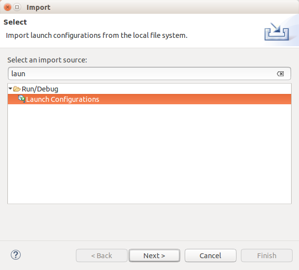
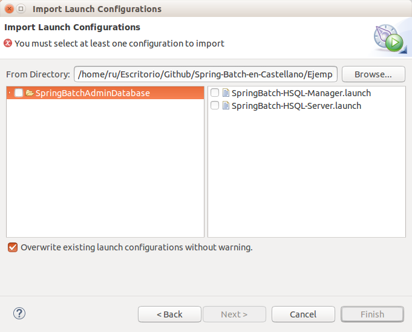
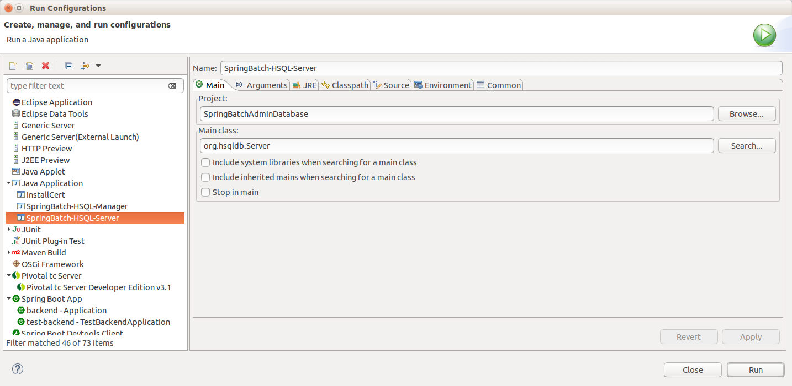
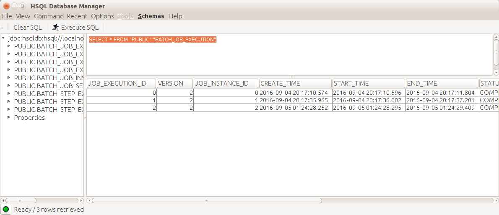

# Spring Batch Database HSQLDB

El conjunto de ejemplos se complementa con una base de datos externa HSQLDB en la que persistir el resultado de las ejecuciones de los procesos batch para posteriormente consultarlas mediante la web de Spring Batch Admin.

## Estructura, configuración y utilización

La estructura del proyecto se compone de la siguiente estructura y scripts útiles para poder desplegar la base de datos de Spring Batch para la versión 3.0.X:

* **SpringBatch-HSQL-Server.launch:** Launcher que tras ejecutarlo se iniciará la base de datos HSQL.

La **url** de conexión a la base de datos tras iniciar será la siguiente: 

> jdbc:hsqldb:hsql://localhost:9005/store/spring-batch-database

* **SpringBatch-HSQL-Manager.launch:** Launcher que tras iniciar la base de datos HSQL nos permitirá consultarla y editarla.

Para la primera ejecución la base de datos se encontrará vacía y será necesario crear el esquema de base de datos. Para ello se facilita en el proyecto el esquema de base de datos en el fichero **schema/schema-hsqldb.sql**.

* **Schema:** Se incluyen los fichero schema-hsqldb.sql con el modelo de base de datos de Spring Batch 3.0.X que permite crear la base de datos inicial y el fichero schema-drop-hsqldb.sql para eliminar la base de datos.

* **Store:** Directorio en el que se generarán los ficheros temporales de la base de datos para almacenar la información de cada ejecución.
