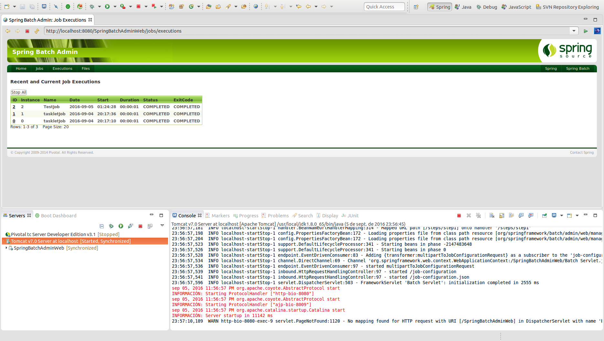

# Spring Batch Admin Web

Spring Batch Admin facilita una web de administración que permite consultar el estado de las ejecuciones de los procesos batch implementados con el framework Spring Batch.

Esta configuración de Spring Batch Admin Web se basa en la versión Open Source disponible en [Github](https://github.com/spring-projects/spring-batch-admin).

## Prerequisitos

Para poder iniciar la ejecución de Spring Batch Admin Web es necesario previamente **iniciar el proyecto SpringBatchAdminDatabase**, proyecto que iniciará la base de datos HSQLDB en la que se persistirá la información de los procesos batch.

## Ejecución

Para realizar el despliegue de la aplicación será necesario emplar un servidor de aplicaciones (tomcat, jetty, tcserver, ...).

La url de acceso a la consola es la siguiente:

> http://localhost:8080/SpringBatchAdminWeb/jobs

