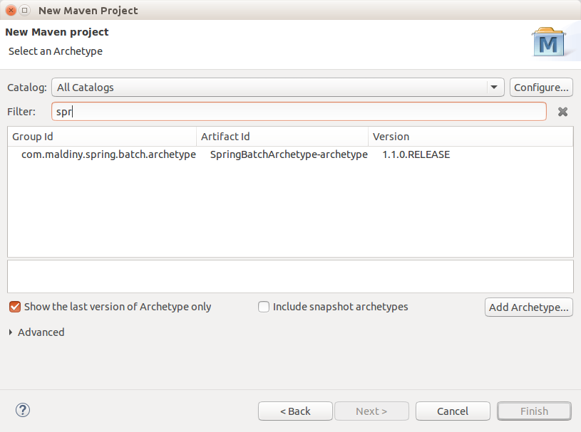
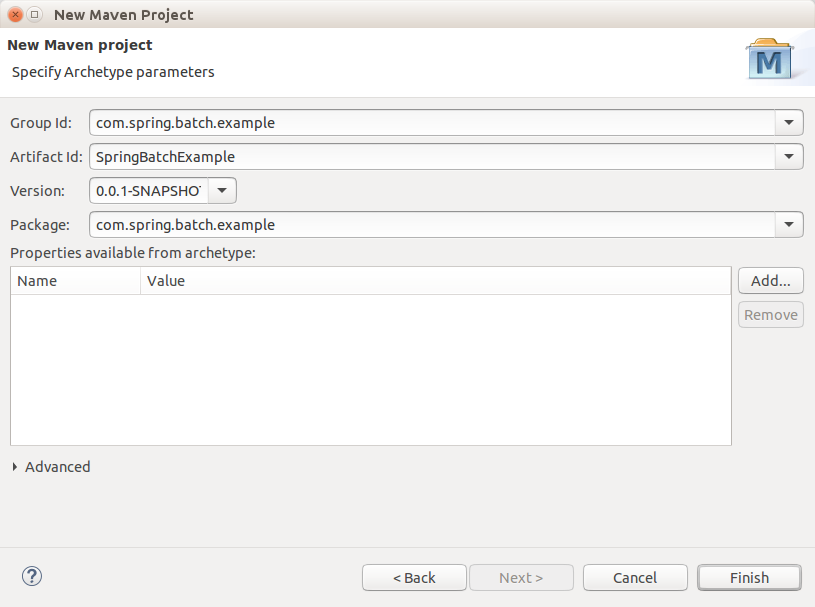

# Spring Batch Archetype

El <a href="https://maven.apache.org/guides/introduction/introduction-to-archetypes.html" target="_blank">arquetipo</a> maven facilita la creación de proyectos batch utilizando el framework Spring Batch.

## Utilización

Para poder hacer uso del arquetipo es necesario seguir los siguientes pasos:

* **Compilado del código fuente del arquetipo:** mvn clean archetype:create-from-project
* **Instalación del arquetipo en el repositorio maven:** mvn clean install -f target/generated-sources/archetype/
* **Creación del nuevo proyecto utilizando el arquetipo:** Crear un nuevo proyecto maven desde el IDE y seleccionar el arquetipo del siguiente modo:
 

