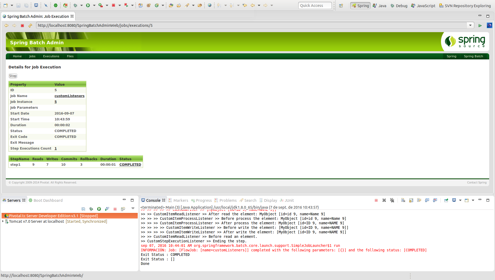

# Custom Listeners

Los listeners en Spring Batch permiten agregar funcionalidad en distintos puntos de la ejecución del ciclo de vida del batch. Por ello se distinguen seis tipos diferentes en función de ello:

- [StepExecutionListener](http://docs.spring.io/spring-batch/apidocs/org/springframework/batch/core/StepExecutionListener.html)
- [ItemReadListener](http://docs.spring.io/spring-batch/apidocs/org/springframework/batch/core/ItemReadListener.html)
- [ItemProcessListener](http://docs.spring.io/spring-batch/apidocs/org/springframework/batch/core/ItemProcessListener.html)
- [ItemWriteListener](http://docs.spring.io/spring-batch/apidocs/org/springframework/batch/core/ItemWriteListener.html)
- [ChunkListener](http://docs.spring.io/spring-batch/apidocs/org/springframework/batch/core/ChunkListener.html)
- [SkipListener](http://docs.spring.io/spring-batch/apidocs/org/springframework/batch/core/SkipListener.html)

## Codificación

La asociación de un determinado listener a la ejecución de un step del batch se implementa del modo que se muestra a continuación:

```xml
<job id="customListeners" xmlns="http://www.springframework.org/schema/batch">
	<step id="step1">
		<tasklet>
			<chunk reader="customReader" processor="customProcesor" writer="customWriter" commit-interval="1" skip-policy="customSkipPolicy"/>
			<batch:listeners>
				<batch:listener ref="customStepExecutionListener"/>
				<batch:listener ref="customItemReadListener"/>
				<batch:listener ref="customItemProcessListener"/>
				<batch:listener ref="customItemWriteListener"/>
				<batch:listener ref="customChunkListener"/>
				<batch:listener ref="customSkipListener"/>
			</batch:listeners>
		</tasklet>
	</step>
</job>
```

Vamos a ir viendo cada uno de ellos.

* **CustomStepExecutionListener**: Permite introducir funcionalidad al comiendo y finalización de un step del siguiente modo:

```java
public class CustomStepExecutionListener implements StepExecutionListener {

	@Override
	public ExitStatus afterStep(StepExecution arg0) {
		System.out.println(">> CustomStepExecutionListener >> Ending the step.");
		return null;
	}

	@Override
	public void beforeStep(StepExecution arg0) {
		System.out.println(">> CustomStepExecutionListener >> Starting the step.");	
	}
}
```

* **customItemReadListener**: Permite introducir funcionalidad al comienzo y finalización de la lectura de cada elemento de un ItemReader, adicionalmente incluye un método que permite interceptar aquellos registros que hayan producido un error. Su implementación sigue el siguiente patrón:

```java
public class CustomItemReadListener implements ItemReadListener<MyObject> {

	@Override
	public void afterRead(MyObject arg0) {
		System.out.println(">> >> CustomItemReadListener >> After read the element: " + arg0);
	}

	@Override
	public void beforeRead() {
		System.out.println(">> >> CustomItemReadListener >> Before read an element.");
	}

	@Override
	public void onReadError(Exception arg0) {
		System.out.println(">> >> CustomItemReadListener >> onReadError: " + arg0);
	}
}
```

* **customItemProcessListener**: Permite introducir funcionalidad al comienzo y finalización de la lectura de cada elemento de un ItemProcess, adicionalmente incluye un método que permite interceptar aquellos registros que hayan producido un error. Su implementación sigue el siguiente patrón:

```java
public class CustomItemProcessListener implements ItemProcessListener<MyObject, MyObject> {

	@Override
	public void afterProcess(MyObject arg0, MyObject arg1) {
		System.out.println(">> >> >> CustomItemProcessListener >> After process the element: " + arg0);
	}

	@Override
	public void beforeProcess(MyObject arg0) {
		System.out.println(">> >> >> CustomItemProcessListener >> Before process the element: " + arg0);
	}

	@Override
	public void onProcessError(MyObject arg0, Exception arg1) {
		System.out.println(">> >> >> CustomItemProcessListener >> Error processing the element: " + arg0);
	}

}
```

* **customItemWriteListener**: Permite introducir funcionalidad al comienzo y finalización de la escritura de cada elemento de un ItemWriter, adicionalmente incluye un método que permite interceptar aquellos registros que hayan producido un error. Su implementación sigue el siguiente patrón:

```java
public class CustomItemWriteListener implements ItemWriteListener<MyObject> {

	@Override
	public void afterWrite(List<? extends MyObject> arg0) {
		System.out.println(">> >> >> >> CustomItemWriteListener >> After write the element: " + arg0);
	}

	@Override
	public void beforeWrite(List<? extends MyObject> arg0) {
		System.out.println(">> >> >> >> CustomItemWriteListener >> Before write the element: " + arg0);
	}

	@Override
	public void onWriteError(Exception arg0, List<? extends MyObject> arg1) {
		
		StringBuilder elements = new StringBuilder();
		
		for (MyObject myObject : arg1) {
			elements.append(myObject).append(",");
		}
		
		System.out.println(">> >> >> >> CustomItemWriteListener >> Error writing the elements: " + elements + " with error:" + arg0);
		
	}
}
```

* **customChunkListener**: Permite introducir funcionalidad al comienzo y finalización de la escritura de cada elemento de un Chunk, adicionalmente incluye un método que permite interceptar aquellos registros que hayan producido un error. Su implementación sigue el siguiente patrón:

```java
public class CustomChunkListener implements ChunkListener {

	@Override
	public void afterChunk(ChunkContext arg0) {
		System.out.println(">> CustomChunkListener >> After chunk execution: " + arg0);
	}

	@Override
	public void afterChunkError(ChunkContext arg0) {
		System.out.println(">> CustomChunkListener >> After chunk ERROR execution: " + arg0);
	}

	@Override
	public void beforeChunk(ChunkContext arg0) {
		System.out.println(">> CustomChunkListener >> Before chunk execution: " + arg0);
	}
}
```

* **customSkipListener**: Permite introducir funcionalidad al saltarse la ejecución de alguno de los elementos en el ciclo de vida step, tanto lectura, procesamiento y escritura. Su implementación sigue el siguiente patrón:

```java
public class CustomSkipListener implements SkipListener<MyObject, MyObject> {

	@Override
	public void onSkipInProcess(MyObject arg0, Throwable arg1) {
		System.err.println("*************** CustomSkipListener >> Skip in process: " + arg0);
	}

	@Override
	public void onSkipInRead(Throwable arg0) {
		System.err.println("*************** CustomSkipListener >> Skip in read: " + arg0);
	}

	@Override
	public void onSkipInWrite(MyObject arg0, Throwable arg1) {
		System.err.println("*************** CustomSkipListener >> Skip in write: " + arg0);
	}

}
```

Adicionalemnte, permite establecer una configuración en la que se va a proceder a establecer un step con estado fallido tras varios errores en la ejecución del proceso. Para ello se incluye en el chunk la propiedad **skip-policy="customSkipPolicy"** configurada del siguiente modo:

```xml
<bean id="customSkipPolicy" class="com.maldiny.spring.batch.custom.listeners.CustomSkipPolicy">
	<property name="skipLimit" value="10" /> <!-- The skip-limit="10" attribute is not used -->
</bean>
```

Y posteriormente su funcionalidad para configurar una funcionalidad adicional:

public class CustomSkipPolicy implements SkipPolicy {

```java
private int skipLimit;
	
	@Override
	public boolean shouldSkip(Throwable t, int skipCount) throws SkipLimitExceededException {
		if (t instanceof CustomSkipableException && skipCount <= skipLimit) {
            return true;
        } else {
            return false;
        }
	}

	public void setSkipLimit(int skipLimit) {
        this.skipLimit = skipLimit;
    }
}
```

## Ejecución

Para realizar la ejecución del proceso batch realizaremos la ejecución desde la clase Main.

```cmd
INFORMACIÓN: Executing step: [step1]
>> CustomStepExecutionListener >> Starting the step.
>> >> CustomItemReadListener >> Before read an element.
>> >> CustomItemReadListener >> After read the element: MyObject [id=id 0, name=Name 0]
>> >> >> CustomItemProcessListener >> Before process the element: MyObject [id=id 0, name=Name 0]
>> >> >> CustomItemProcessListener >> After process the element: MyObject [id=ID 0, name=NAME 0]
>> >> >> >> CustomItemWriteListener >> Before write the element: [MyObject [id=ID 0, name=NAME 0]]
>> >> >> >> >> CustomWriter >> [MyObject [id=ID 0, name=NAME 0]]
>> >> >> >> CustomItemWriteListener >> After write the element: [MyObject [id=ID 0, name=NAME 0]]
>> >> CustomItemReadListener >> Before read an element.
>> >> CustomItemReadListener >> After read the element: MyObject [id=id 1, name=Name 1]
>> >> >> CustomItemProcessListener >> Before process the element: MyObject [id=id 1, name=Name 1]
>> >> >> CustomItemProcessListener >> After process the element: MyObject [id=ID 1, name=NAME 1]
>> >> >> >> >> CustomWriter >> [MyObject [id=ID 1, name=NAME 1]]
>> >> >> >> CustomItemWriteListener >> Before write the element: [MyObject [id=ID 1, name=NAME 1]]
>> >> >> >> CustomItemWriteListener >> After write the element: [MyObject [id=ID 1, name=NAME 1]]
>> >> CustomItemReadListener >> Before read an element.
>> >> CustomItemReadListener >> After read the element: MyObject [id=id 2, name=Name 2]
>> >> >> CustomItemProcessListener >> Before process the element: MyObject [id=id 2, name=Name 2]
>> >> >> CustomItemProcessListener >> After process the element: MyObject [id=ID 2, name=NAME 2]
>> >> >> >> CustomItemWriteListener >> Before write the element: [MyObject [id=ID 2, name=NAME 2]]
>> >> >> >> >> CustomWriter >> [MyObject [id=ID 2, name=NAME 2]]
>> >> >> >> CustomItemWriteListener >> After write the element: [MyObject [id=ID 2, name=NAME 2]]
>> >> CustomItemReadListener >> Before read an element.
>> >> CustomItemReadListener >> onReadError: com.maldiny.spring.batch.custom.listeners.CustomSkipableException
>> >> CustomItemReadListener >> Before read an element.
>> >> CustomItemReadListener >> After read the element: MyObject [id=id 4, name=Name 4]
>> >> >> CustomItemProcessListener >> Before process the element: MyObject [id=id 4, name=Name 4]
>> >> >> CustomItemProcessListener >> Error processing the element: MyObject [id=id 4, name=Name 4]
>> >> >> >> CustomItemWriteListener >> Before write the element: []
>> >> >> >> >> CustomWriter >> []
>> >> >> >> CustomItemWriteListener >> After write the element: []
*************** CustomSkipListener >> Skip in process: MyObject [id=id 4, name=Name 4]
*************** CustomSkipListener >> Skip in read: com.maldiny.spring.batch.custom.listeners.CustomSkipableException
>> >> CustomItemReadListener >> Before read an element.
>> >> CustomItemReadListener >> After read the element: MyObject [id=id 5, name=Name 5]
>> >> >> CustomItemProcessListener >> Before process the element: MyObject [id=id 5, name=Name 5]
>> >> >> CustomItemProcessListener >> After process the element: MyObject [id=ID 5, name=NAME 5]
>> >> >> >> CustomItemWriteListener >> Before write the element: [MyObject [id=ID 5, name=NAME 5]]
>> >> >> >> CustomItemWriteListener >> Error writing the elements: MyObject [id=ID 5, name=NAME 5], with error:com.maldiny.spring.batch.custom.listeners.CustomSkipableException
>> >> >> CustomItemProcessListener >> Before process the element: MyObject [id=ID 5, name=NAME 5]
>> >> >> CustomItemProcessListener >> After process the element: MyObject [id=ID 5, name=NAME 5]
>> >> >> >> CustomItemWriteListener >> Error writing the elements: MyObject [id=ID 5, name=NAME 5], with error:com.maldiny.spring.batch.custom.listeners.CustomSkipableException
*************** CustomSkipListener >> Skip in write: MyObject [id=ID 5, name=NAME 5]
>> >> CustomItemReadListener >> Before read an element.
>> >> CustomItemReadListener >> After read the element: MyObject [id=id 6, name=Name 6]
>> >> >> CustomItemProcessListener >> Before process the element: MyObject [id=id 6, name=Name 6]
>> >> >> CustomItemProcessListener >> After process the element: MyObject [id=ID 6, name=NAME 6]
>> >> >> >> CustomItemWriteListener >> Before write the element: [MyObject [id=ID 6, name=NAME 6]]
>> >> >> >> >> CustomWriter >> [MyObject [id=ID 6, name=NAME 6]]
>> >> >> >> CustomItemWriteListener >> After write the element: [MyObject [id=ID 6, name=NAME 6]]
>> >> CustomItemReadListener >> Before read an element.
>> >> CustomItemReadListener >> After read the element: MyObject [id=id 7, name=Name 7]
>> >> >> CustomItemProcessListener >> Before process the element: MyObject [id=id 7, name=Name 7]
>> >> >> CustomItemProcessListener >> After process the element: MyObject [id=ID 7, name=NAME 7]
>> >> >> >> CustomItemWriteListener >> Before write the element: [MyObject [id=ID 7, name=NAME 7]]
>> >> >> >> >> CustomWriter >> [MyObject [id=ID 7, name=NAME 7]]
>> >> >> >> CustomItemWriteListener >> After write the element: [MyObject [id=ID 7, name=NAME 7]]
>> >> CustomItemReadListener >> Before read an element.
>> >> CustomItemReadListener >> After read the element: MyObject [id=id 8, name=Name 8]
>> >> >> CustomItemProcessListener >> Before process the element: MyObject [id=id 8, name=Name 8]
>> >> >> CustomItemProcessListener >> After process the element: MyObject [id=ID 8, name=NAME 8]
>> >> >> >> CustomItemWriteListener >> Before write the element: [MyObject [id=ID 8, name=NAME 8]]
>> >> >> >> >> CustomWriter >> [MyObject [id=ID 8, name=NAME 8]]
>> >> >> >> CustomItemWriteListener >> After write the element: [MyObject [id=ID 8, name=NAME 8]]
>> >> CustomItemReadListener >> Before read an element.
>> >> CustomItemReadListener >> After read the element: MyObject [id=id 9, name=Name 9]
>> >> >> CustomItemProcessListener >> Before process the element: MyObject [id=id 9, name=Name 9]
>> >> >> CustomItemProcessListener >> After process the element: MyObject [id=ID 9, name=NAME 9]
>> >> >> >> CustomItemWriteListener >> Before write the element: [MyObject [id=ID 9, name=NAME 9]]
>> >> >> >> >> CustomWriter >> [MyObject [id=ID 9, name=NAME 9]]
>> >> >> >> CustomItemWriteListener >> After write the element: [MyObject [id=ID 9, name=NAME 9]]
>> >> CustomItemReadListener >> Before read an element.
>> CustomStepExecutionListener >> Ending the step.
sep 07, 2016 10:41:17 AM org.springframework.batch.core.launch.support.SimpleJobLauncher$1 run
INFORMACIÓN: Job: [FlowJob: [name=customListeners]] completed with the following parameters: [{}] and the following status: [COMPLETED]
Exit Status : COMPLETED
Exit Status : []
Done
```

## Ejecución Standalone

Para poder realizar la ejecución desde un proceso externo, bastará con empaquetar el proyecto generando el jar con el comando **mvn install** en la raiz del proyecto, y posteriormente en la carpeta **target**, ejecutar el siguiente comando:

> java -jar com.maldiny.spring.batch.custom.listeners.SpringBatchCustomListeners.1.0.jar

## Ejecución en la base de datos HSQLDB externa

Para poder realizar la ejecución empleando la base de datos HSQLDB externa los pasos a seguir son los siguientes:

* **Iniciar la base de datos HSQLDB:** Emplear el lanzador SpringBatch-HSQL-Server incluido en el proyecto SpringBatchAdminDatabase.
* **Cambiar la configuración de base de datos del proyecto:** Para ello es necesario modificar el fichero src/main/resources/spring/batch/jobs/job-config.xml para descomentar la línea 10 y comentar la línea 11 del documento del siguiente modo:

```xml
<import resource="../config/database-hsqldb-context.xml" /> <!-- External HSQLDB Database -->
<!-- <import resource="../config/database-context.xml" /> --> <!-- Internal HSQLDB Database -->
```

Una vez modificado, lanzamos el proceso batch y accedemos a la url del portal Spring Batch Admin en la siguiente URL:

> http://localhost:8080/SpringBatchAdminWeb/jobs

<p align="center"></p>

Como se puede ver en la imagen adjunta, se ha producido tanto la lectura como la escritura de diez elementos.