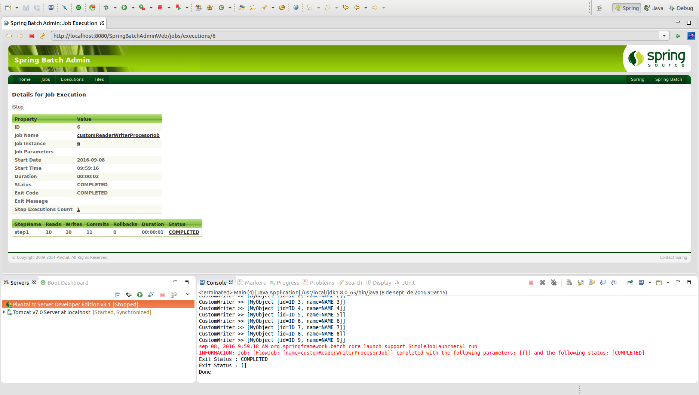

# Custom ItemReader, ItemWriter y ItemProcesor

Un **Chunk** se corresponde con la tipología de steps más utilizada en los procesos batch. Consisten en la construcción de un componente especializado en la lectura de elementos **(ItemReader)**, un componente encargado de su procesamiento opcional **(ItemProcessor)** y un componente que se encarga de la persistencia **(ItemWriter)**.

<p align="center"></p>

Los distintos elementos que constituyen un chunk podrán sobreescribirse para customizarse en función de las necesidades de negocio. El flujo de un chunk se complementará al introducir políticas de reintento y omisión de registros.

## Codificación

La codificación del job para emplear elementos customizados en un chunk seguirá la siguiente nomenclatura:

```xml
<job id="customReaderWriterProcesorJob" xmlns="http://www.springframework.org/schema/batch">
	<step id="step1">
		<tasklet>
			<chunk reader="customReader" processor="customProcesor" writer="customWriter" commit-interval="1" />
		</tasklet>
	</step>
</job>
```

* **Reader:** Elemento responsable de leer datos de una fuente de datos (BBDD, fichero, cola de mensajes, etc…).
* **Processor (Opcional):** Elemento responsable tratar la información obtenida por el reader. No es obligatorio su uso.
* **Writer:** Elemento responsable guardar la información leída por el reader o tratada por el processor. Si hay un reader debe haber un writer.

Tanto el Reader como el Writer que constituyen el chunk se realizarán con una implementación propia:

```xml
<bean id="customReader" class="com.maldiny.spring.batch.custom.reader.writer.procesor.CustomReader"/>
<bean id="customWriter" class="com.maldiny.spring.batch.custom.reader.writer.procesor.CustomWriter"/>
<bean id="customProcesor" class="com.maldiny.spring.batch.custom.reader.writer.procesor.CustomProcesor"/>
```

* **CustomReader:** El reader se encargará de instanciar diez objetos de la clase MyObject. El reader finalizará su ejecución al retornar null.

```java
public class CustomReader implements ItemReader<MyObject> {
	
	static int counter = 0;

	@Override
	public MyObject read() throws Exception, UnexpectedInputException, ParseException, NonTransientResourceException {
		
		final MyObject item = new MyObject("id " + counter, "Name " + counter);
		
		counter++;
		
		// The step ends when the reader returns null.
		if(counter > 10){
			return null;
		}
		
		return item;
		
	}

}
```

* **CustomProcesor:** El Procesor realizará el procesamiento y customización e incluirá la lógica de negocio específica para cada uno de los objetos. En este caso recibirá el listado de elementos de uno en uno al tener configurado un **commit-interval = 1**.

```java
public class CustomProcesor implements ItemProcessor<MyObject, MyObject> {

	@Override
	public MyObject process(MyObject arg0) throws Exception {
		arg0.setId(arg0.getId().toUpperCase());
		
		arg0.setName(arg0.getName().toUpperCase());
		
		return arg0;
	}

}
```

* **CustomWriter:** El Writer realizará la lectura de cada uno de los objetos. En este caso recibirá el listado de elementos de uno en uno al tener configurado un **commit-interval = 1**.

```java
public class CustomWriter implements ItemWriter<MyObject> {

	@Override
	public void write(List<? extends MyObject> arg0) throws Exception {

		System.out.println("CustomWriter >> " + arg0);
		
	}

}
```

## Ejecución

Para realizar la ejecución del proceso batch realizaremos la ejecución desde la clase Main.

```cmd
INFORMACIÓN: Executing step: [step1]
CustomWriter >> [MyObject [id=ID 0, name=NAME 0]]
CustomWriter >> [MyObject [id=ID 1, name=NAME 1]]
CustomWriter >> [MyObject [id=ID 2, name=NAME 2]]
CustomWriter >> [MyObject [id=ID 3, name=NAME 3]]
CustomWriter >> [MyObject [id=ID 4, name=NAME 4]]
CustomWriter >> [MyObject [id=ID 5, name=NAME 5]]
CustomWriter >> [MyObject [id=ID 6, name=NAME 6]]
CustomWriter >> [MyObject [id=ID 7, name=NAME 7]]
CustomWriter >> [MyObject [id=ID 8, name=NAME 8]]
CustomWriter >> [MyObject [id=ID 9, name=NAME 9]]
sep 08, 2016 9:55:09 AM org.springframework.batch.core.launch.support.SimpleJobLauncher$1 run
INFORMACIÓN: Job: [FlowJob: [name=customReaderWriterProcesorJob]] completed with the following parameters: [{}] and the following status: [COMPLETED]
Exit Status : COMPLETED
Exit Status : []
Done
```

Como se puede apreciar en la salida de la ejecución del batch, se han modificado tanto el ID como el name de cada objeto pasándolos a mayúsculas, ya que es la lógica de negocio implementada en el CustomItemProcesor para este ejemplo en particular.

## Ejecución Standalone

Para poder realizar la ejecución desde un proceso externo, bastará con empaquetar el proyecto generando el jar con el comando **mvn install** en la raiz del proyecto, y posteriormente en la carpeta **target**, ejecutar el siguiente comando:

> java -jar com.maldiny.spring.batch.custom.reader.writer.procesor.SpringBatchCustomReaderWriterProcesor.1.0.jar

## Ejecución en la base de datos HSQLDB externa

Para poder realizar la ejecución empleando la base de datos HSQLDB externa los pasos a seguir son los siguientes:

* **Iniciar la base de datos HSQLDB:** Emplear el lanzador SpringBatch-HSQL-Server incluido en el proyecto SpringBatchAdminDatabase.
* **Cambiar la configuración de base de datos del proyecto:** Para ello es necesario modificar el fichero src/main/resources/spring/batch/jobs/job-config.xml para descomentar la línea 10 y comentar la línea 11 del documento del siguiente modo:

```xml
<import resource="../config/database-hsqldb-context.xml" /> <!-- External HSQLDB Database -->
<!-- <import resource="../config/database-context.xml" /> --> <!-- Internal HSQLDB Database -->
```

Una vez modificado, lanzamos el proceso batch y accedemos a la url del portal Spring Batch Admin en la siguiente URL:

> http://localhost:8080/SpringBatchAdminWeb/jobs

<p align="center"></p>

Como se puede ver en la imagen adjunta, se ha producido tanto la lectura como la escritura de diez elementos.


