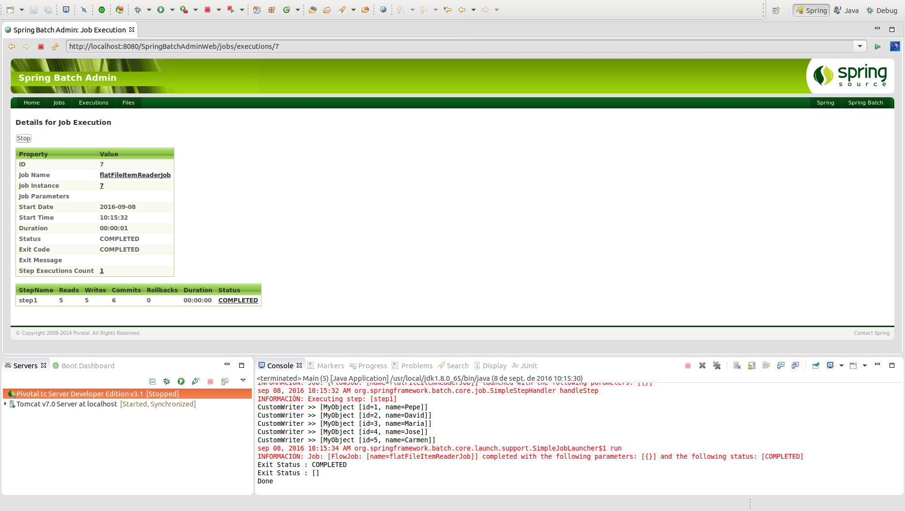

# FlatFileItemReader

Componente genérico de Spring Batch que permite realizar la **obtención de información en un fichero o stream.**.

## Codificación

La estructura empleada en el ejemplo consiste en la lectura de información de un fichero CSV y escritura por pantalla de la información contenida en cada uno de los elementos:

```xml
<job id="flatFileItemReaderJob" xmlns="http://www.springframework.org/schema/batch">
	<step id="step1">
		<tasklet>
			<chunk reader="cvsFileItemReader" writer="customWriter" commit-interval="1" />
		</tasklet>
	</step>
</job>
```

* **cvsFileItemReader:** Componente que permite realizar la lecura de cada uno de los elementos definidos en el CSV de entrada. La estructura de entrada del ejemplo consiste en dos columnas, en la que en la primera de ellas se definirá el ID y en la segunda el nombre de cada elemento.

```xml
<bean id="cvsFileItemReader" class="org.springframework.batch.item.file.FlatFileItemReader">
	<property name="resource" value="file:csv/inputs/report.csv" />
	<property name="lineMapper">
	    <bean class="org.springframework.batch.item.file.mapping.DefaultLineMapper">
		<property name="lineTokenizer">
			<bean
				class="org.springframework.batch.item.file.transform.DelimitedLineTokenizer">
				<property name="names" value="id,name" />
			</bean>
		</property>
		<property name="fieldSetMapper">
			<bean class="com.maldiny.spring.batch.flatfileitemreader.MyObjectFieldSetMapper" />
		</property>
	    </bean>
	</property>
</bean>
```

Como se puede ver en la definición del bean, en este caso emplearemos un componente específico de Spring Batch de la clase **org.springframework.batch.item.file.FlatFileItemReader**. En él, definiremos los siguientes atributos:

* **Resource:** Recurso de entrada (fichero).
* **lineTokenizer:** Permite realizar la lectura de información. Se podrán establecer el orden de carga de los elementos.
* **FieldSetMapper:** Componente que permite realizar el mapeo de la información obtenida a objetos generados con una determinada clase. En este caso, es importante resaltar la estructura que deberá tener la clase que realiza el mapeo de campos en los objetos que se emplearán en los siguientes steps definidos en el batch:

```java
public class MyObjectFieldSetMapper implements FieldSetMapper<MyObject> {

	@Override
	public MyObject mapFieldSet(FieldSet fieldSet) throws BindException {
		MyObject myObject = new MyObject("" + fieldSet.readInt(0), fieldSet.readString(1));
		return myObject;
	}

}
```

## Ejecución

Para realizar la ejecución del proceso batch realizaremos la ejecución desde la clase Main.

```cmd
INFORMACIÓN: Executing step: [step1]
CustomWriter >> [MyObject [id=1, name=Pepe]]
CustomWriter >> [MyObject [id=2, name=David]]
CustomWriter >> [MyObject [id=3, name=Maria]]
CustomWriter >> [MyObject [id=4, name=Jose]]
CustomWriter >> [MyObject [id=5, name=Carmen]]
sep 08, 2016 10:13:39 AM org.springframework.batch.core.launch.support.SimpleJobLauncher$1 run
INFORMACIÓN: Job: [FlowJob: [name=flatFileItemReaderJob]] completed with the following parameters: [{}] and the following status: [COMPLETED]
Exit Status : COMPLETED
Exit Status : []
Done
```

Como se puede apreciar en la salida de la ejecución del batch, se muestra cada uno de los elementos definidos en el csv de entrada report.csv.

## Ejecución Standalone

Para poder realizar la ejecución desde un proceso externo, bastará con empaquetar el proyecto generando el jar con el comando **mvn install** en la raiz del proyecto, y posteriormente en la carpeta **target**, ejecutar el siguiente comando:

> java -jar com.maldiny.spring.batch.flatfileitemreader.SpringBatchFlatFileItemReader.1.0.jar

## Ejecución en la base de datos HSQLDB externa

Para poder realizar la ejecución empleando la base de datos HSQLDB externa los pasos a seguir son los siguientes:

* **Iniciar la base de datos HSQLDB:** Emplear el lanzador SpringBatch-HSQL-Server incluido en el proyecto SpringBatchAdminDatabase.
* **Cambiar la configuración de base de datos del proyecto:** Para ello es necesario modificar el fichero src/main/resources/spring/batch/jobs/job-config.xml para descomentar la línea 10 y comentar la línea 11 del documento del siguiente modo:

```xml
<import resource="../config/database-hsqldb-context.xml" /> <!-- External HSQLDB Database -->
<!-- <import resource="../config/database-context.xml" /> --> <!-- Internal HSQLDB Database -->
```

Una vez modificado, lanzamos el proceso batch y accedemos a la url del portal Spring Batch Admin en la siguiente URL:

> http://localhost:8080/SpringBatchAdminWeb/jobs

<p align="center"></p>

Como se puede ver en la imagen adjunta, se ha producido tanto la lectura como la escritura de diez elementos.