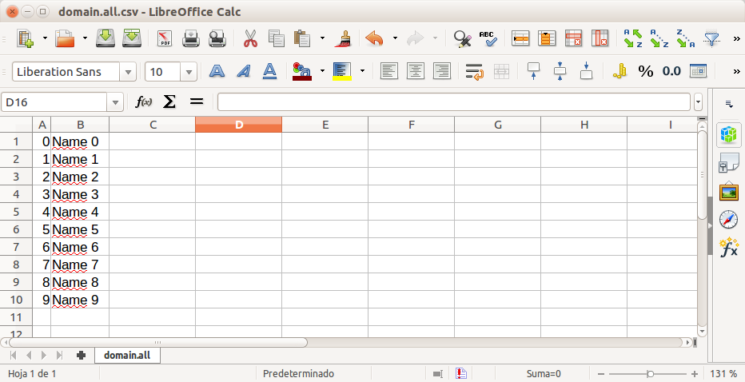
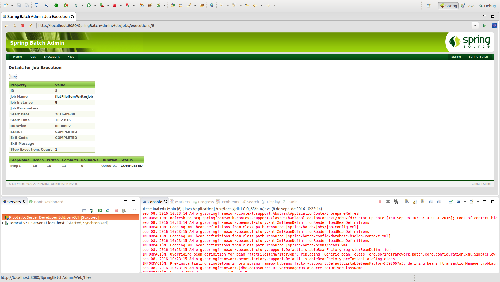

# FlatFileItemReader

Componente genérico de Spring Batch que permite realizar la **persistencia de la información en un fichero o stream.**.

## Codificación

La estructura empleada en el ejemplo consiste en generación de información en el reader y escritura en un csv de la información contenida en cada uno de los elementos:

```xml
<job id="flatFileItemWriterJob" xmlns="http://www.springframework.org/schema/batch">
	<step id="step1">
		<tasklet>
			<chunk reader="customReader" writer="flatFileItemWriter" commit-interval="1" />
		</tasklet>
	</step>
</job>
```

* **flatFileItemWriter:** Componente que permite realizar la escritura de cada uno de los elementos generados en el reader. La estructura de entrada del ejemplo consiste en dos columnas, en la que en la primera de ellas se definirá el ID y en la segunda el nombre de cada elemento.

```xml
<bean id="flatFileItemWriter" class="org.springframework.batch.item.file.FlatFileItemWriter">
	<property name="resource" value="file:csv/outputs/domain.all.csv" />
	<property name="appendAllowed" value="true" />
	<property name="lineAggregator">
		<bean
			class="org.springframework.batch.item.file.transform.DelimitedLineAggregator">
			<property name="delimiter" value="," />
			<property name="fieldExtractor">
				<bean
					class="org.springframework.batch.item.file.transform.BeanWrapperFieldExtractor">
					<property name="names" value="id, name" />
				</bean>
			</property>
		</bean>
	</property>
</bean>
```

Como se puede ver en la definición del bean, en este caso emplearemos un componente específico de Spring Batch de la clase **org.springframework.batch.item.file.FlatFileItemWriter**. En él, definiremos los siguientes atributos:

* **Resource:** Recurso de salida (fichero).
* **appendAllowed:** Atributo que nos permitirá concatenar información en el fichero de salida en el caso de que exista previamente.
* **lineAggregator:** Componente principal del writer en el que se definirá entre diversos ccampos como se puede ver en el ejemplo el delimitador, la estructura, ...

## Ejecución

Para realizar la ejecución del proceso batch realizaremos la ejecución desde la clase Main.

```cmd
INFORMACIÓN: Executing step: [step1]
sep 08, 2016 10:23:18 AM org.springframework.batch.core.launch.support.SimpleJobLauncher$1 run
INFORMACIÓN: Job: [FlowJob: [name=flatFileItemWriterJob]] completed with the following parameters: [{}] and the following status: [COMPLETED]
Exit Status : COMPLETED
Exit Status : []
Done
```

Al acceder al CSV de salida vemos que contiene la información de los objetos generados en el reader:

<p align="center"></p>

## Ejecución Standalone

Para poder realizar la ejecución desde un proceso externo, bastará con empaquetar el proyecto generando el jar con el comando **mvn install** en la raiz del proyecto, y posteriormente en la carpeta **target**, ejecutar el siguiente comando:

> java -jar com.maldiny.spring.batch.flatfileitemwriter.SpringBatchFlatFileItemWriter.1.0.jar

## Ejecución en la base de datos HSQLDB externa

Para poder realizar la ejecución empleando la base de datos HSQLDB externa los pasos a seguir son los siguientes:

* **Iniciar la base de datos HSQLDB:** Emplear el lanzador SpringBatch-HSQL-Server incluido en el proyecto SpringBatchAdminDatabase.
* **Cambiar la configuración de base de datos del proyecto:** Para ello es necesario modificar el fichero src/main/resources/spring/batch/jobs/job-config.xml para descomentar la línea 10 y comentar la línea 11 del documento del siguiente modo:

```xml
<import resource="../config/database-hsqldb-context.xml" /> <!-- External HSQLDB Database -->
<!-- <import resource="../config/database-context.xml" /> --> <!-- Internal HSQLDB Database -->
```

Una vez modificado, lanzamos el proceso batch y accedemos a la url del portal Spring Batch Admin en la siguiente URL:

> http://localhost:8080/SpringBatchAdminWeb/jobs

<p align="center"></p>

Como se puede ver en la imagen adjunta, se ha producido tanto la lectura como la escritura de diez elementos.