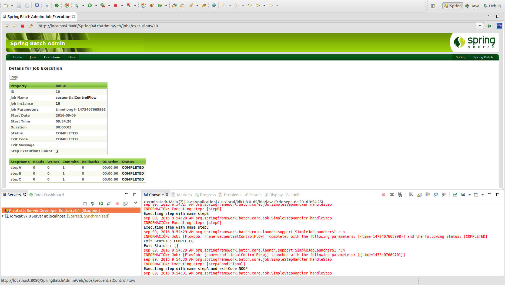
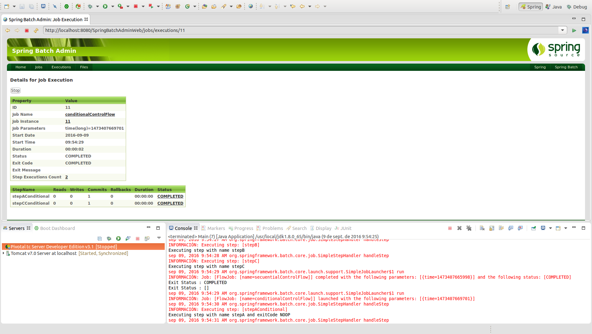

# Flow Control - Control del flujo de ejecución

A través del **control de flujo** de ejecución de Steps es posible definir lógicas de negocio en función del estado de salida de otros Steps.

<p align="center"></p>

```xml
<job id="job">
    <step id="stepA" next="stepB”/>
    <step id="stepB" next="stepC”/>
    <step id="stepC"/>
</step>
```

<p align="center"></p>

```xml
<job id="job">
    <step id="stepA">
    	<next on="*" to="stepB"> // * -> 0 o más caracteres
    	<next on="FAILED" to="stepC"> 
    </step>
    <step id="stepB"/>
    <step id="stepC"/>
</step>
```

Otros elementos a tener en cuenta en la definición de flujos entre steps:

* **BatchStatus**: Representa el estado de un Job o Step (COMPLETED, STARTED, FAILED,...)
* **ExitStatus**: Representa el estado de un Step al finalizar su ejecución.
* Tag **end**: Determina la finalización inmediata del Job tras cumplir su condición. ExitStatus y BatchStatus en estado COMPLETED.
* Tag **fail**: Determina la finalización inmediata del Job tras cumplir su condición. ExitStatus y BatchStatus en estado FAILED.
* Tag **stop**: Determina la parada inmediata del Job tras cumplir su condición. BatchStatus en estado STOPPED.

## Codificación

Para poder realizar un ejemplo completo de control de flujo, tanto condicional como secuencial, se han definido dos jobs independientes:

```xml
<job id="secuentialControlFlow" xmlns="http://www.springframework.org/schema/batch">
	<step id="stepA" next="stepB">
    	<tasklet ref="stepABean"/>
    </step>
    <step id="stepB" next="stepC">
    	<tasklet ref="stepBBean"/>
    </step>
    <step id="stepC">
    	<tasklet ref="stepCBean"/>
    </step>
</job>
<job id="conditionalControlFlow" xmlns="http://www.springframework.org/schema/batch">
	<step id="stepAConditional">
    	<tasklet ref="stepAConditionalBean"/>
    	<next on="COMPLETED" to="stepBConditional" />
    	<next on="NOOP" to="stepCConditional" />
    </step>
    <step id="stepBConditional">
    	<tasklet ref="stepBConditionalBean"/>
    </step>
    <step id="stepCConditional">
    	<tasklet ref="stepCConditionalBean"/>
    </step>
</job>
```

* **secuentialControlFlow:** Job que define un flujo secuencial en el que se ejecutarán ordenadamente el stepA, stepB y stepC.
* **conditionalControlFlow:** Job que define un flujo condicional en el que se ejecutará inicialmente el step stepAConditional, y en función de un valor aleatorio por cada ejecución, su salida será COMPLETED o NOOP, estado que definirá si se ejecutará el stepBConditional o bien stepCConditional respectivamente.


## Ejecución

Para realizar la ejecución del proceso batch realizaremos la ejecución desde la clase Main.

```cmd
INFORMACIÓN: Executing step: [stepA]
Executing step with name stepA
sep 09, 2016 9:45:00 AM org.springframework.batch.core.job.SimpleStepHandler handleStep
INFORMACIÓN: Executing step: [stepB]
Executing step with name stepB
sep 09, 2016 9:45:00 AM org.springframework.batch.core.job.SimpleStepHandler handleStep
INFORMACIÓN: Executing step: [stepC]
Executing step with name stepC
sep 09, 2016 9:45:00 AM org.springframework.batch.core.launch.support.SimpleJobLauncher$1 run
INFORMACIÓN: Job: [FlowJob: [name=secuentialControlFlow]] completed with the following parameters: [{}] and the following status: [COMPLETED]
Exit Status : COMPLETED
Exit Status : []
sep 09, 2016 9:45:00 AM org.springframework.batch.core.launch.support.SimpleJobLauncher$1 run
INFORMACIÓN: Job: [FlowJob: [name=conditionalControlFlow]] launched with the following parameters: [{}]
sep 09, 2016 9:45:00 AM org.springframework.batch.core.job.SimpleStepHandler handleStep
INFORMACIÓN: Executing step: [stepAConditional]
Executing step with name stepA and exitCode COMPLETED
sep 09, 2016 9:45:00 AM org.springframework.batch.core.job.SimpleStepHandler handleStep
INFORMACIÓN: Executing step: [stepBConditional]
Executing step with name stepB and exitCode COMPLETED
sep 09, 2016 9:45:00 AM org.springframework.batch.core.launch.support.SimpleJobLauncher$1 run
INFORMACIÓN: Job: [FlowJob: [name=conditionalControlFlow]] completed with the following parameters: [{}] and the following status: [COMPLETED]
Exit Status : COMPLETED
Exit Status : []
Done
```

Como se puede ver, inicialmente se ha ejecutado el secuentialControlFlow y a continuación el job conditionalControlFlow, que en este caso, la salida de su step stepAConditional es COMPLETED por lo que se ejecuta el stepBConditional.

## Ejecución Standalone

Para poder realizar la ejecución desde un proceso externo, bastará con empaquetar el proyecto generando el jar con el comando **mvn install** en la raiz del proyecto, y posteriormente en la carpeta **target**, ejecutar el siguiente comando:

> java -jar com.maldiny.spring.batch.flow.control.SpringBatchFlowControl.1.0.jar

## Ejecución en la base de datos HSQLDB externa

Para poder realizar la ejecución empleando la base de datos HSQLDB externa los pasos a seguir son los siguientes:

* **Iniciar la base de datos HSQLDB:** Emplear el lanzador SpringBatch-HSQL-Server incluido en el proyecto SpringBatchAdminDatabase.
* **Cambiar la configuración de base de datos del proyecto:** Para ello es necesario modificar el fichero src/main/resources/spring/batch/jobs/job-config.xml para descomentar la línea 10 y comentar la línea 11 del documento del siguiente modo:

```xml
<import resource="../config/database-hsqldb-context.xml" /> <!-- External HSQLDB Database -->
<!-- <import resource="../config/database-context.xml" /> --> <!-- Internal HSQLDB Database -->
```

Una vez modificado, lanzamos el proceso batch y accedemos a la url del portal Spring Batch Admin en la siguiente URL:

> http://localhost:8080/SpringBatchAdminWeb/jobs

<p align="center"></p>
<p align="center"></p>

