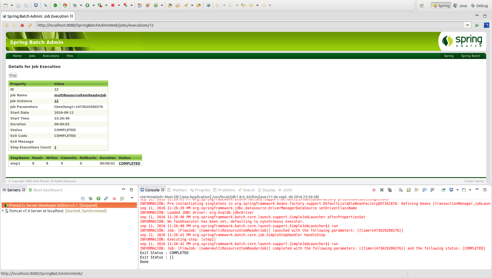

# Lectura de varios ficheros simultáneamente - MultiResourceItemReader

Es un requisito habitual procesar varios ficheros como entrada de un único Step. Si asumimos que todos los ficheros tienen el mismo formato, **MultiResourceItemReader** permite realizar este tipo de entrada tanto para XML como para un FlatFileItemReader.

```xml
<bean id="multiResourceReader" class="org.spr...MultiResourceItemReader">
    <property name="resources" value="classpath:data/input/file-*.txt" />
    <property name="delegate" ref="flatFileItemReader" />
</bean>
```

Este ejemplo se apoyará en el uso de un **FlatFileItemReader**. Esta configuración de entrada para ambos ficheros, maneja tanto el rollback como el reinicio del step de manera controlada.

Se recomienda que cada Job trabaje con su propio **directorio de forma individual** hasta que se complete la ejecución.

## Codificación

Para poder realizar un ejemplo de lectura de varios ficheros de entrada bastará con definir un chunk como el siguiente:

```xml
<job id="multiResourceItemReaderJob" xmlns="http://www.springframework.org/schema/batch">
	<step id="step1">
		<tasklet>
			<chunk reader="multiResourceReader" writer="flatFileItemWriter" commit-interval="1" />
		</tasklet>
	</step>
</job>
```

El bean **multiResourceReader** consolidará la lectura de varios ficheros del siguiente modo:

```xml
<bean id="flatFileItemReader" class="org.springframework.batch.item.file.FlatFileItemReader">
	<property name="lineMapper">
		<bean class="org.springframework.batch.item.file.mapping.DefaultLineMapper">
			<property name="lineTokenizer">
				<bean
					class="org.springframework.batch.item.file.transform.DelimitedLineTokenizer">
					<property name="names" value="id, name" />
				</bean>
			</property>
			<property name="fieldSetMapper">
				<bean
					class="org.springframework.batch.item.file.mapping.BeanWrapperFieldSetMapper">
					<property name="prototypeBeanName" value="myDomain" />
				</bean>
			</property>
		</bean>
	</property>
</bean>

<bean id="multiResourceReader" class=" org.springframework.batch.item.file.MultiResourceItemReader">
	<property name="resources" value="file:csv/inputs/domain-*.csv" />
	<property name="delegate" ref="flatFileItemReader" />
</bean>
```


## Ejecución

Para realizar la ejecución del proceso batch realizaremos la ejecución desde la clase Main.

```cmd
INFORMACIÓN: Executing step: [step1]
sep 11, 2016 11:24:28 PM org.springframework.batch.core.launch.support.SimpleJobLauncher$1 run
INFORMACIÓN: Job: [FlowJob: [name=multiResourceItemReaderJob]] completed with the following parameters: [{time=1473629068202}] and the following status: [COMPLETED]
Exit Status : COMPLETED
Exit Status : []
Done
```

## Ejecución Standalone

Para poder realizar la ejecución desde un proceso externo, bastará con empaquetar el proyecto generando el jar con el comando **mvn install** en la raiz del proyecto, y posteriormente en la carpeta **target**, ejecutar el siguiente comando:

> java -jar com.maldiny.spring.batch.multiresourceitemreader.SpringBatchMultiResourceItemReader.1.0.jar

## Ejecución en la base de datos HSQLDB externa

Para poder realizar la ejecución empleando la base de datos HSQLDB externa los pasos a seguir son los siguientes:

* **Iniciar la base de datos HSQLDB:** Emplear el lanzador SpringBatch-HSQL-Server incluido en el proyecto SpringBatchAdminDatabase.
* **Cambiar la configuración de base de datos del proyecto:** Para ello es necesario modificar el fichero src/main/resources/spring/batch/jobs/job-config.xml para descomentar la línea 10 y comentar la línea 11 del documento del siguiente modo:

```xml
<import resource="../config/database-hsqldb-context.xml" /> <!-- External HSQLDB Database -->
<!-- <import resource="../config/database-context.xml" /> --> <!-- Internal HSQLDB Database -->
```

Una vez modificado, lanzamos el proceso batch y accedemos a la url del portal Spring Batch Admin en la siguiente URL:

> http://localhost:8080/SpringBatchAdminWeb/jobs

<p align="center"></p>

