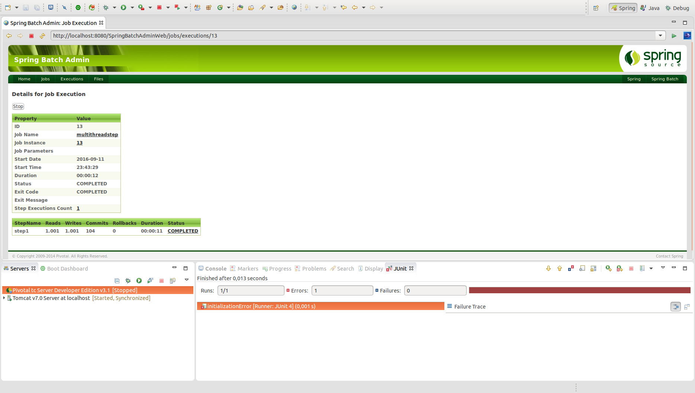

# Ejecución de un step por varios hilos simultánemante - MultiThreadStep

Para configurar la ejecución de un mismo step por varios hilos la forma más simple es la creación de un pool de hilos mediante la configuración de un TaskExecutor. Su definición se realizará del siguiente modo:

```xml
<step id="step1">
    <tasklet task-executor="taskExecutor" throttle-limit="20">
….
….
    </tasklet>
</step>
```

La implementación del objeto "taskExecutor" podrá cualquier implementación de la interfaz TaskExecutor, por ejemplo, **SimpleAsyncTaskExecutor**.

En este caso, cada hilo realizará la ejecución del mismo step de forma independiente, pudiendo realizarse el procesado de elementos de manera no consecutiva. En algunas situaciones será necesario limitar el número de hilos, para ello se especificará el parámetro **throttle-limit**.

**IMPORTANTE: Verificar que los componentes utilizados sean “thread safe” y se puedan utilizar en steps multihilo.**

## Codificación

Para poder realizar un ejemplo de ejecución multihilo se deberá configurar un job del siguiente modo:

```xml
<job id="chunkJob" xmlns="http://www.springframework.org/schema/batch">
	<step id="step1">
		<tasklet task-executor="taskExecutor">
			<chunk reader="customReader" writer="customWriter" commit-interval="10" />
		</tasklet>
	</step>
</job>
```

El número de hilos simultáneos configurado se definirá por la variable **concurrencyLimit**.

```xml
<bean id="taskExecutor" class="org.springframework.core.task.SimpleAsyncTaskExecutor">
	<property name="concurrencyLimit" value="3"/>
</bean>
```

## Ejecución

Para realizar la ejecución del proceso batch realizaremos la ejecución desde la clase Main.

```cmd
INFORMACIÓN: Executing step: [step1]
CustomWriter >> [MyObject [id=id 0, name=Name 0], MyObject [id=id 3, name=Name 3], MyObject [id=id 6, name=Name 6], MyObject [id=id 9, name=Name 9], MyObject [id=id 12, name=Name 12], MyObject [id=id 15, name=Name 15], MyObject [id=id 18, name=Name 18], MyObject [id=id 22, name=Name 22], MyObject [id=id 26, name=Name 26], MyObject [id=id 28, name=Name 28]]
CustomWriter >> [MyObject [id=id 0, name=Name 0], MyObject [id=id 3, name=Name 3], MyObject [id=id 6, name=Name 6], MyObject [id=id 9, name=Name 9], MyObject [id=id 12, name=Name 12], MyObject [id=id 15, name=Name 15], MyObject [id=id 18, name=Name 18], MyObject [id=id 21, name=Name 21], MyObject [id=id 24, name=Name 25], MyObject [id=id 29, name=Name 29]]
CustomWriter >> [MyObject [id=id 0, name=Name 0], MyObject [id=id 3, name=Name 3], MyObject [id=id 6, name=Name 6], MyObject [id=id 9, name=Name 9], MyObject [id=id 12, name=Name 12], MyObject [id=id 15, name=Name 15], MyObject [id=id 18, name=Name 18], MyObject [id=id 21, name=Name 21], MyObject [id=id 22, name=Name 22], MyObject [id=id 24, name=Name 27]]
....
....
....
CustomWriter >> [MyObject [id=id 990, name=Name 990], MyObject [id=id 991, name=Name 991], MyObject [id=id 992, name=Name 992], MyObject [id=id 993, name=Name 993], MyObject [id=id 994, name=Name 994], MyObject [id=id 995, name=Name 995], MyObject [id=id 996, name=Name 996], MyObject [id=id 997, name=Name 997], MyObject [id=id 998, name=Name 998], MyObject [id=id 999, name=Name 999]]
CustomWriter >> [MyObject [id=id 1000, name=Name 1000]]
sep 11, 2016 11:43:42 PM org.springframework.batch.core.launch.support.SimpleJobLauncher$1 run
INFORMACIÓN: Job: [FlowJob: [name=multithreadstep]] completed with the following parameters: [{}] and the following status: [COMPLETED]
Exit Status : COMPLETED
Time (seconds): 1.2599907E7
Exit Status : []
Done
```

## Ejecución Standalone

Para poder realizar la ejecución desde un proceso externo, bastará con empaquetar el proyecto generando el jar con el comando **mvn install** en la raiz del proyecto, y posteriormente en la carpeta **target**, ejecutar el siguiente comando:

> java -jar com.maldiny.spring.batch.springbatchmutithreadstep.SpringBatchMultiThreadStep.1.0.jar

## Ejecución en la base de datos HSQLDB externa

Para poder realizar la ejecución empleando la base de datos HSQLDB externa los pasos a seguir son los siguientes:

* **Iniciar la base de datos HSQLDB:** Emplear el lanzador SpringBatch-HSQL-Server incluido en el proyecto SpringBatchAdminDatabase.
* **Cambiar la configuración de base de datos del proyecto:** Para ello es necesario modificar el fichero src/main/resources/spring/batch/jobs/job-config.xml para descomentar la línea 10 y comentar la línea 11 del documento del siguiente modo:

```xml
<import resource="../config/database-hsqldb-context.xml" /> <!-- External HSQLDB Database -->
<!-- <import resource="../config/database-context.xml" /> --> <!-- Internal HSQLDB Database -->
```

Una vez modificado, lanzamos el proceso batch y accedemos a la url del portal Spring Batch Admin en la siguiente URL:

> http://localhost:8080/SpringBatchAdminWeb/jobs

<p align="center"></p>

