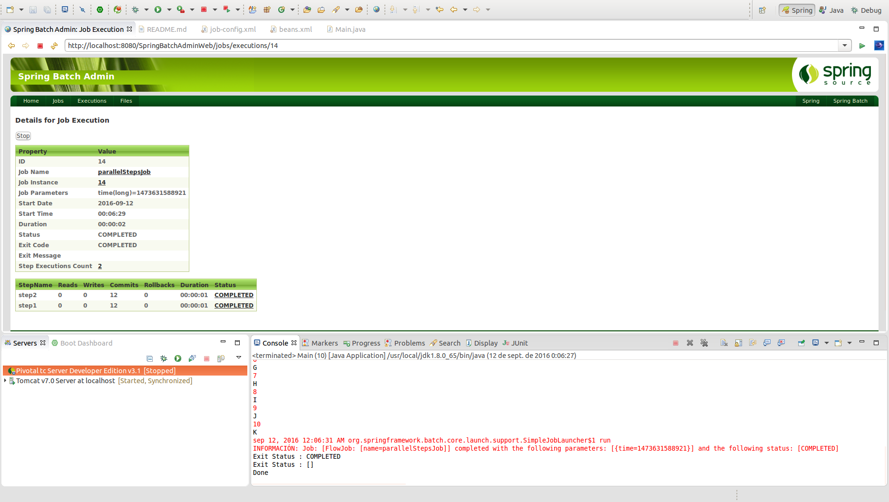

# Ejecución simultánea de steps - ParallelSteps

En la definición de la estructura de determinados batchs es posible identificar cierta lógica u operativa que es necesaria **paralelizar**. Para ello es posible particionar y delegar responsabilidades de la operativa asignándoles **steps individuales** que poder paralelizar en un único proceso. La **configuración** necesaria para poder paralelizar steps sería la siguiente:

```xml
<job id="job1">
	<split id="split1" task-executor="taskExecutor" next="step4">
		<flow>
			<step id="step1" parent="s1" next="step2"/>
			<step id="step2" parent="s2"/>
		</flow>
 		<flow>
			<step id="step3" parent="s3"/>
		</flow>
	</split>
</job>
<beans:bean id="taskExecutor" class="org.spr...SimpleAsyncTaskExecutor"/>
```

Como se puede ver en el código, es necesario realizar la definición de un elemento "taskExecutor" que hace referencia a la implementación del **TaskExecutor** a emplear para ejecutar cada uno de los flujos de trabajo.

SyncTaskExecutor es la implementación por defecto de TaskExecutor. 

**El job no finalizará su estado como completo hasta que puede agregar el estado de salida de cada uno de los flujos.**

## Codificación

Para poder realizar un ejemplo de ejecución paralela de steps se deberá configurar un job del siguiente modo:

```xml
<job id="parallelStepsJob" xmlns="http://www.springframework.org/schema/batch">
	<split id="split1" task-executor="taskExecutor">
        <flow>
            <step id="step1" >
            	<tasklet ref="customLetterTasklet"/>
            </step>
        </flow>
        <flow>
            <step id="step2" >
            	<tasklet ref="customNumberTasklet"/>
            </step>
        </flow>
    </split>
</job>
```

El número de hilos simultáneos configurado se definirá por la variable **concurrencyLimit**.

```xml
<bean id="taskExecutor" class="org.springframework.core.task.SimpleAsyncTaskExecutor">
	<property name="concurrencyLimit" value="3"/>
</bean>
```

## Ejecución

Para realizar la ejecución del proceso batch realizaremos la ejecución desde la clase Main.

```cmd
INFORMACIÓN: Executing step: [step1]
0
A
1
B
2
C
3
D
4
E
5
F
6
G
7
H
8
I
9
J
10
K
sep 12, 2016 12:06:31 AM org.springframework.batch.core.launch.support.SimpleJobLauncher$1 run
INFORMACIÓN: Job: [FlowJob: [name=parallelStepsJob]] completed with the following parameters: [{time=1473631588921}] and the following status: [COMPLETED]
Exit Status : COMPLETED
Exit Status : []
Done
```

## Ejecución Standalone

Para poder realizar la ejecución desde un proceso externo, bastará con empaquetar el proyecto generando el jar con el comando **mvn install** en la raiz del proyecto, y posteriormente en la carpeta **target**, ejecutar el siguiente comando:

> java -jar com.maldiny.spring.batch.parallel.steps.SpringBatchParallelSteps.1.0.jar

## Ejecución en la base de datos HSQLDB externa

Para poder realizar la ejecución empleando la base de datos HSQLDB externa los pasos a seguir son los siguientes:

* **Iniciar la base de datos HSQLDB:** Emplear el lanzador SpringBatch-HSQL-Server incluido en el proyecto SpringBatchAdminDatabase.
* **Cambiar la configuración de base de datos del proyecto:** Para ello es necesario modificar el fichero src/main/resources/spring/batch/jobs/job-config.xml para descomentar la línea 10 y comentar la línea 11 del documento del siguiente modo:

```xml
<import resource="../config/database-hsqldb-context.xml" /> <!-- External HSQLDB Database -->
<!-- <import resource="../config/database-context.xml" /> --> <!-- Internal HSQLDB Database -->
```

Una vez modificado, lanzamos el proceso batch y accedemos a la url del portal Spring Batch Admin en la siguiente URL:

> http://localhost:8080/SpringBatchAdminWeb/jobs

<p align="center"></p>

