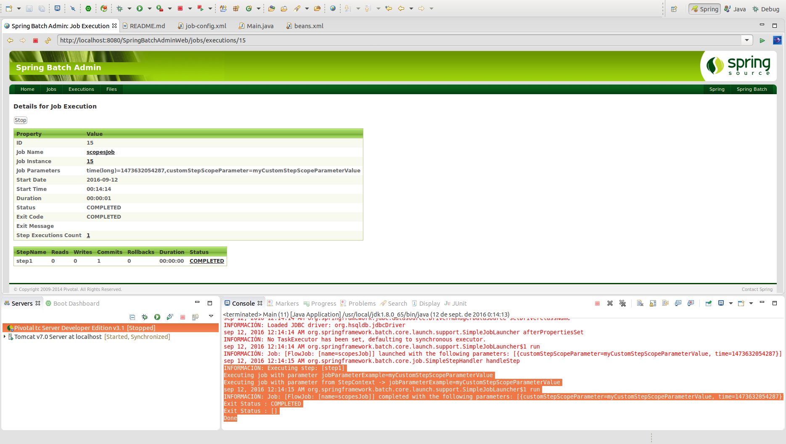

# Scopes

El Scope permite definir el ámbito en el que se desea crear un bean y en qué momento de la fase de generación de objetos del contenedor de Spring se va a crear permitiendo de este modo definir el orden de generación.

Es necesario incorporar al XML el siguiente namespace:

```xml
<beans ….  xmlns:batch="http://www.springframework.org/schema/batch"...
```

* **Step Scope:** Se requiere esta configuración en el caso de que sea necesario que el Step se inicie antes de que se cree la instancia del Bean (carga de propiedades, enlace con base de datos,...)

```xml
<bean id="step1" scope=”step”>
……
</bean>
```

* **Job Scope:** Sólo permitirá la creación de un determinado bean por job. Permitirá recuperar propiedades del job, jobExecutionContext o jobParameters.

```xml
<bean id="step1" scope=”job”>
……
</bean>
```

## Codificación

Para poder realizar un ejemplo de ejecución de un job  con varios scopes es preciso configurar un job del siguiente modo:

```xml
<job id="scopesJob" xmlns="http://www.springframework.org/schema/batch">
	<step id="step1">
		<tasklet ref="customTasklet"/>
	</step>
</job>
```

En primer lugar es necesario definir un bean de la clase **StepScope** y adicionalmente agregar el scope="step" al bean que se desee configurar con digo scope:

```xml
<!-- This scope is not available by default, but will be if you are using 
	the batch XML namespace. If you are not, adding the following to your Spring 
	configuration will make the scope available, per the Spring Batch documentation -->
<bean class="org.springframework.batch.core.scope.StepScope" />

<!-- If scope="step" attribute is removed, jobParameters object will not be found -->
<bean id="customTasklet" class="com.maldiny.spring.batch.scopes.CustomTasklet" scope="step">
	<property name="jobParameterExample" value="#{jobParameters['customStepScopeParameter']}" />
</bean>
```

## Ejecución

Para realizar la ejecución del proceso batch realizaremos la ejecución desde la clase Main.

```cmd
INFORMACIÓN: Executing step: [step1]
Executing job with parameter jobParameterExample=myCustomStepScopeParameterValue
Executing job with parameter from StepContext -> jobParameterExample=myCustomStepScopeParameterValue
sep 12, 2016 12:14:15 AM org.springframework.batch.core.launch.support.SimpleJobLauncher$1 run
INFORMACIÓN: Job: [FlowJob: [name=scopesJob]] completed with the following parameters: [{customStepScopeParameter=myCustomStepScopeParameterValue, time=1473632054287}] and the following status: [COMPLETED]
Exit Status : COMPLETED
Exit Status : []
Done
```

## Ejecución Standalone

Para poder realizar la ejecución desde un proceso externo, bastará con empaquetar el proyecto generando el jar con el comando **mvn install** en la raiz del proyecto, y posteriormente en la carpeta **target**, ejecutar el siguiente comando:

> java -jar com.maldiny.spring.batch.scopes.SpringBatchScopes.1.0.jar

## Ejecución en la base de datos HSQLDB externa

Para poder realizar la ejecución empleando la base de datos HSQLDB externa los pasos a seguir son los siguientes:

* **Iniciar la base de datos HSQLDB:** Emplear el lanzador SpringBatch-HSQL-Server incluido en el proyecto SpringBatchAdminDatabase.
* **Cambiar la configuración de base de datos del proyecto:** Para ello es necesario modificar el fichero src/main/resources/spring/batch/jobs/job-config.xml para descomentar la línea 10 y comentar la línea 11 del documento del siguiente modo:

```xml
<import resource="../config/database-hsqldb-context.xml" /> <!-- External HSQLDB Database -->
<!-- <import resource="../config/database-context.xml" /> --> <!-- Internal HSQLDB Database -->
```

Una vez modificado, lanzamos el proceso batch y accedemos a la url del portal Spring Batch Admin en la siguiente URL:

> http://localhost:8080/SpringBatchAdminWeb/jobs

<p align="center"></p>

