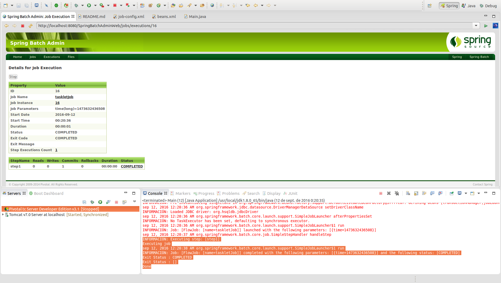

# Tasklets

Un **tasklet** es un objeto que contiene cualquier lógica que será ejecutada como parte de un trabajo. Se construyen mediante la implementación de la interfaz Tasklet y son la forma más simple para ejecutar código. 

La **interfaz Tasklet** contiene únicamente un método execute que será ejecutado repetidamente mientras el retorno del Tasklet sea distinto a RepeatStatus.FINISHED o bien se lance una excepción.

```xml
<step id="step1">
    <tasklet ref="myTasklet" />
</step>
```

Se puede emplear el TaskletAdapter para customizar el método al que invocar del siguiente modo:

```xml
<bean id="myTasklet" class="org.springframework.batch.core.step.tasklet.MethodInvokingTaskletAdapter">
 <property name="targetObject">
 <bean class="my.class.CustomTaskletAdapterClass"/>
 </property>
 <property name="targetMethod" value="myCustomMethod" />
</bean>
```

## Codificación

Para poder realizar un ejemplo de ejecución de un job con un tasklet podrá configurarse del siguiente modo:

```xml
<job id="taskletJob" xmlns="http://www.springframework.org/schema/batch">
	<step id="step1">
		<tasklet ref="customTasklet"/>
	</step>
</job>
```

Y a continuación definir el bean que implementará la interfaz de un tasklet:

```xml
<bean id="customTasklet" class="com.maldiny.spring.batch.tasklet.CustomTasklet"/>
```

## Ejecución

Para realizar la ejecución del proceso batch realizaremos la ejecución desde la clase Main.

```cmd
INFORMACIÓN: Executing step: [step1]
Executing job
sep 12, 2016 12:20:38 AM org.springframework.batch.core.launch.support.SimpleJobLauncher$1 run
INFORMACIÓN: Job: [FlowJob: [name=taskletJob]] completed with the following parameters: [{time=1473632436508}] and the following status: [COMPLETED]
Exit Status : COMPLETED
Exit Status : []
Done
```

## Ejecución Standalone

Para poder realizar la ejecución desde un proceso externo, bastará con empaquetar el proyecto generando el jar con el comando **mvn install** en la raiz del proyecto, y posteriormente en la carpeta **target**, ejecutar el siguiente comando:

> java -jar com.maldiny.spring.batch.tasklet.SpringBatchTasklet.1.0.jar

## Ejecución en la base de datos HSQLDB externa

Para poder realizar la ejecución empleando la base de datos HSQLDB externa los pasos a seguir son los siguientes:

* **Iniciar la base de datos HSQLDB:** Emplear el lanzador SpringBatch-HSQL-Server incluido en el proyecto SpringBatchAdminDatabase.
* **Cambiar la configuración de base de datos del proyecto:** Para ello es necesario modificar el fichero src/main/resources/spring/batch/jobs/job-config.xml para descomentar la línea 10 y comentar la línea 11 del documento del siguiente modo:

```xml
<import resource="../config/database-hsqldb-context.xml" /> <!-- External HSQLDB Database -->
<!-- <import resource="../config/database-context.xml" /> --> <!-- Internal HSQLDB Database -->
```

Una vez modificado, lanzamos el proceso batch y accedemos a la url del portal Spring Batch Admin en la siguiente URL:

> http://localhost:8080/SpringBatchAdminWeb/jobs

<p align="center"></p>

