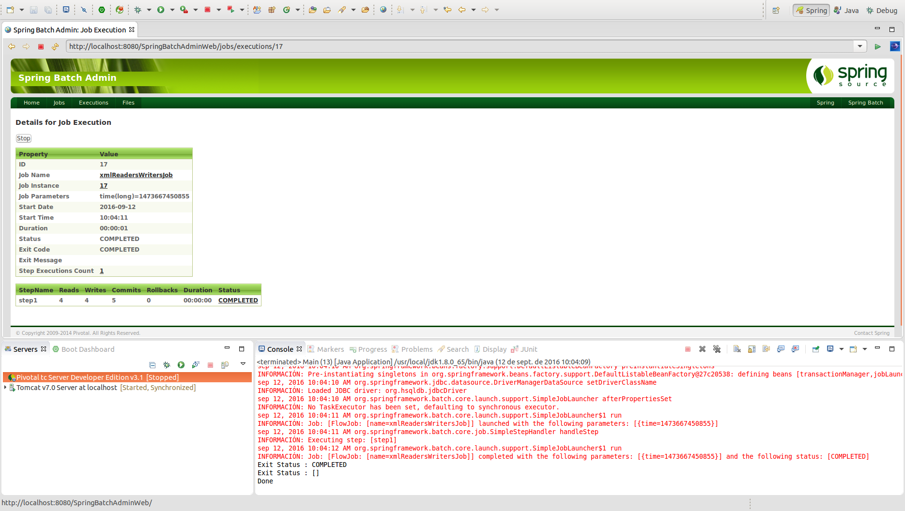

# XML Readers y Writers

Spring Batch facilita utilidades para realizar la lectura y escritura de información en XMLs. A continuación se detalla cómo realizarlo a través del StAX API.

* **StaxEventItemReader** 

```xml
<bean id="itemReader" class="org.springframework.batch.item.xml.StaxEventItemReader">
    <property name="fragmentRootElementName" value="trade" />
    <property name="resource" value="data/iosample/input/input.xml" />
    <property name="unmarshaller" ref="tradeMarshaller" />
</bean>
```

**fragmentRootElementName:** Elemento padre del XML (root-element).
**resource:** Acceso al fichero de entrada que contiene la información en formato XML.
**unmarshaller:** Facilidad OXM que permite realizar el mapeo de los campos definidos en el XML en los campos de objetos Java para su posterior tratamiento y manejo.

```xml
<bean id="tradeMarshaller"
      class="org.springframework.oxm.xstream.XStreamMarshaller">
    <property name="aliases">
        <util:map id="aliases">
            <entry key="trade"  value="org.springframework.batch.sample.domain.Trade" />
            <entry key="price" value="java.math.BigDecimal" />
            <entry key="name" value="java.lang.String" />
        </util:map>
    </property>
</bean>
```

* **StaxEventItemWriter**

```xml
<bean id="itemWriter" class="org.springframework.batch.item.xml.StaxEventItemWriter">
    <property name="resource" ref="outputResource" />
    <property name="marshaller" ref="customerCreditMarshaller" />
    <property name="rootTagName" value="customers" />
    <property name="overwriteOutput" value="true" />
</bean>
```

**rootTagName:** Elemento padre del XML (root-element).
**resource:** Acceso al fichero de entrada que contiene la información en formato XML.
**marshaller:** Facilidad OXM que permite realizar el mapeo de los campos de los objetos Java en los campos del XML.
**overwriteOutput:** Sobreescribe el fichero de salida en caso de existir.

```xml
<bean id="customerCreditMarshaller"
      class="org.springframework.oxm.xstream.XStreamMarshaller">
    <property name="aliases">
        <util:map id="aliases">
            <entry key="custom" value="org.springframework.batch.sample.domain.CustomerCredit" />
            <entry key="credit" value="java.math.BigDecimal" />
            <entry key="name" value="java.lang.String" />
        </util:map>
    </property>
</bean>
```

## Codificación

Para poder realizar un ejemplo de ejecución de un job con un tasklet podrá configurarse del siguiente modo:

```xml
<job id="xmlReadersWritersJob" xmlns="http://www.springframework.org/schema/batch">
	<step id="step1">
		<tasklet>
			<chunk reader="xmlItemReader" writer="xmlItemWriter" commit-interval="1" />
		</tasklet>
	</step>
</job>
```

* **XMLReader:** En primer lugar será necesario definir el XMLReader del siguiente modo:

```xml
<bean id="xmlItemReaderUnmarshaller" class="org.springframework.oxm.xstream.XStreamMarshaller">
    <property name="aliases">
        <util:map id="aliases">
            <entry key="object" value="com.maldiny.spring.batch.springbatchxmlreaderwriter.MyObject" />
        </util:map>
    </property>
    <property name="converters">
        <array>
            <ref bean="customConverter" />
        </array>
    </property>
</bean>

<bean id="xmlItemReader" class="org.springframework.batch.item.xml.StaxEventItemReader">
    <property name="fragmentRootElementName" value="object" />
    <property name="resource" value="file:xml/input/input.xml" />
    <property name="unmarshaller" ref="xmlItemReaderUnmarshaller" />
</bean>

<bean id="customConverter" class="com.maldiny.spring.batch.springbatchxmlreaderwriter.CustomConverter" />
```

Con el objeto customConverter nos permmitirá definir cómmo realizar la lectura de los elementos en el fichero de entrada:

```java
public class CustomConverter implements Converter {

	@Override
	public boolean canConvert(Class arg0) {
		return arg0.equals(MyObject.class);
	}

	@Override
	public void marshal(Object source, HierarchicalStreamWriter writer, MarshallingContext context) {
	}

	@Override
	public Object unmarshal(HierarchicalStreamReader reader, UnmarshallingContext context) {
		reader.moveDown();
		String id = reader.getValue();
		reader.moveUp();
		
		reader.moveDown();
		String name = reader.getValue();
		reader.moveUp();
		
		MyObject object = new MyObject(id, name);
		
		return object;
	}
}
```

* **XMLWriter:** y a continuación será necesario definir el XMLWriter del siguiente modo:
```xml
<bean id="xmlItemWriterUnmarshaller" class="org.springframework.oxm.xstream.XStreamMarshaller">
    <property name="aliases">
        <util:map id="aliases">
            <entry key="object" value="com.maldiny.spring.batch.springbatchxmlreaderwriter.MyObject" />
        </util:map>
    </property>
</bean>

<bean id="xmlItemWriter" class="org.springframework.batch.item.xml.StaxEventItemWriter">
    <property name="resource" value="file:xml/output/output.xml" />
    <property name="marshaller" ref="xmlItemWriterUnmarshaller" />
    <property name="rootTagName" value="items" />
</bean>
```

## Ejecución

Para realizar la ejecución del proceso batch realizaremos la ejecución desde la clase Main.

```cmd
INFORMACIÓN: Executing step: [step1]
sep 12, 2016 10:03:37 AM org.springframework.batch.core.launch.support.SimpleJobLauncher$1 run
INFORMACIÓN: Job: [FlowJob: [name=xmlReadersWritersJob]] completed with the following parameters: [{time=1473667417063}] and the following status: [COMPLETED]
Exit Status : COMPLETED
Exit Status : []
Done
```

## Ejecución Standalone

Para poder realizar la ejecución desde un proceso externo, bastará con empaquetar el proyecto generando el jar con el comando **mvn install** en la raiz del proyecto, y posteriormente en la carpeta **target**, ejecutar el siguiente comando:

> java -jar com.maldiny.spring.batch.tasklet.SpringBatchTasklet.1.0.jar

## Ejecución en la base de datos HSQLDB externa

Para poder realizar la ejecución empleando la base de datos HSQLDB externa los pasos a seguir son los siguientes:

* **Iniciar la base de datos HSQLDB:** Emplear el lanzador SpringBatch-HSQL-Server incluido en el proyecto SpringBatchAdminDatabase.
* **Cambiar la configuración de base de datos del proyecto:** Para ello es necesario modificar el fichero src/main/resources/spring/batch/jobs/job-config.xml para descomentar la línea 10 y comentar la línea 11 del documento del siguiente modo:

```xml
<import resource="../config/database-hsqldb-context.xml" /> <!-- External HSQLDB Database -->
<!-- <import resource="../config/database-context.xml" /> --> <!-- Internal HSQLDB Database -->
```

Una vez modificado, lanzamos el proceso batch y accedemos a la url del portal Spring Batch Admin en la siguiente URL:

> http://localhost:8080/SpringBatchAdminWeb/jobs

<p align="center"></p>

